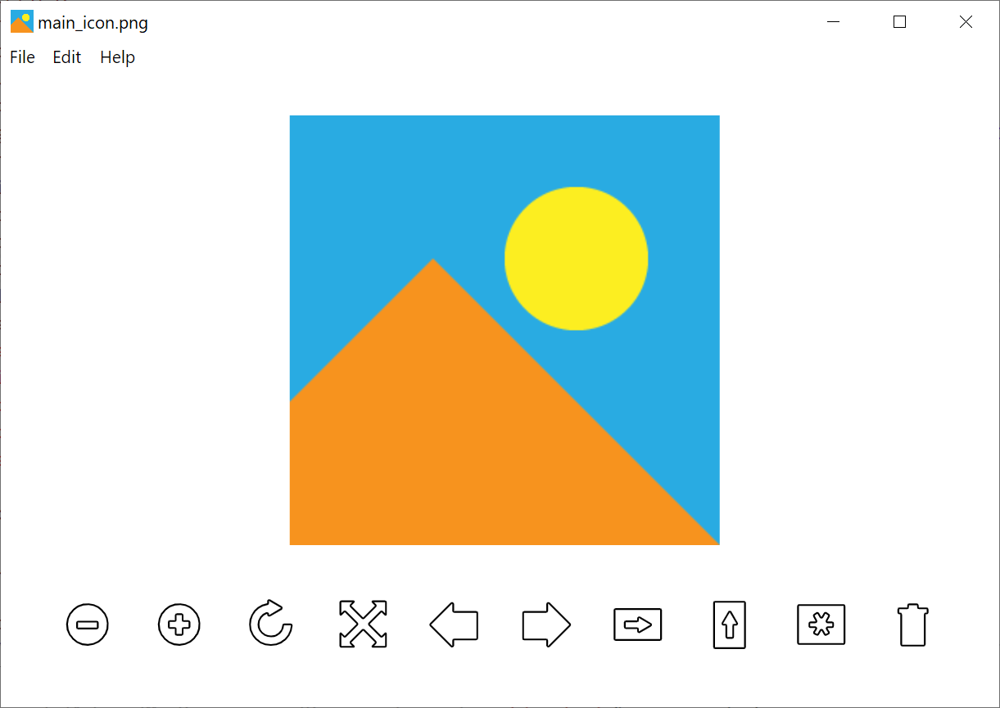

# rview

A simple electron app for viewing images.



# Features

- Pointer zoom
- Flip
- Rotate
- Navigate directory

# Getting Started
```javascript
cd app
npm install
npm start

or

download from release tab
```

# Build
```
cd app
npm run dist
```

# To-Do

- [ ] Support for other operating systems
- [ ] Save images with transformations
